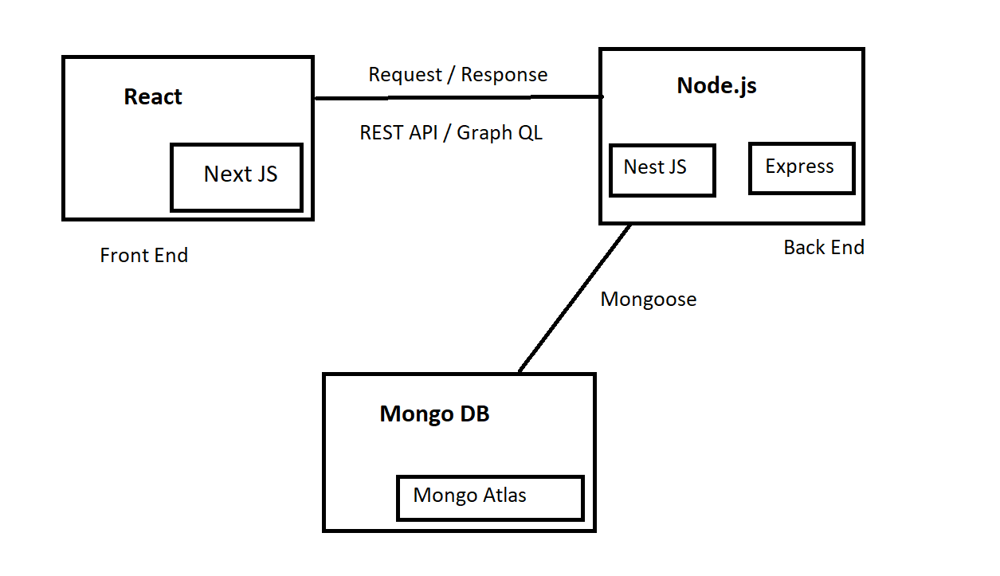
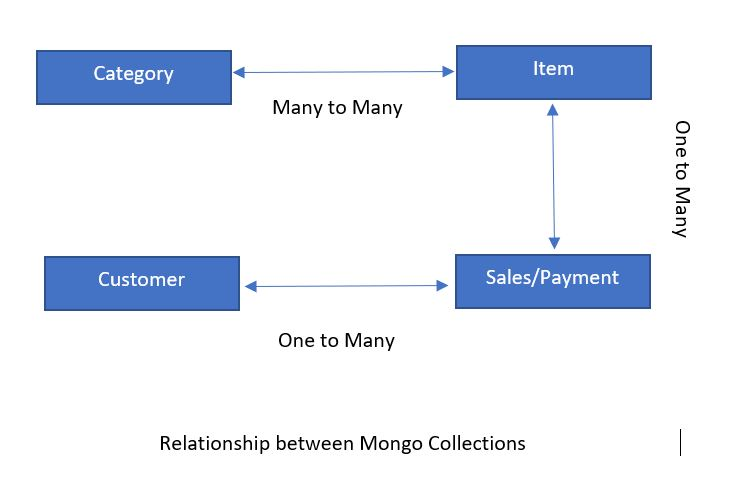
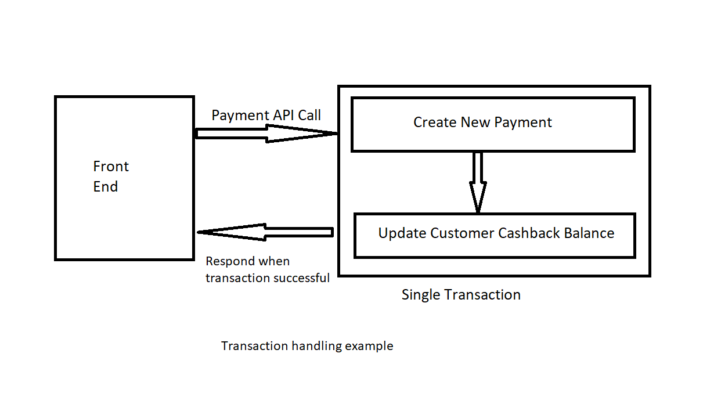
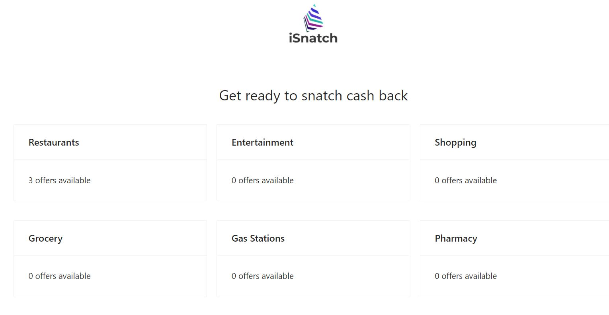
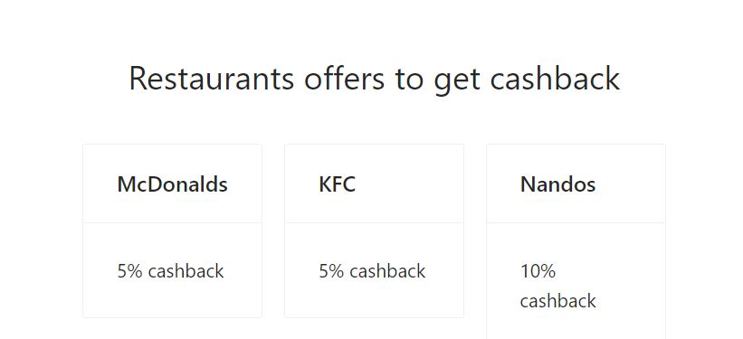
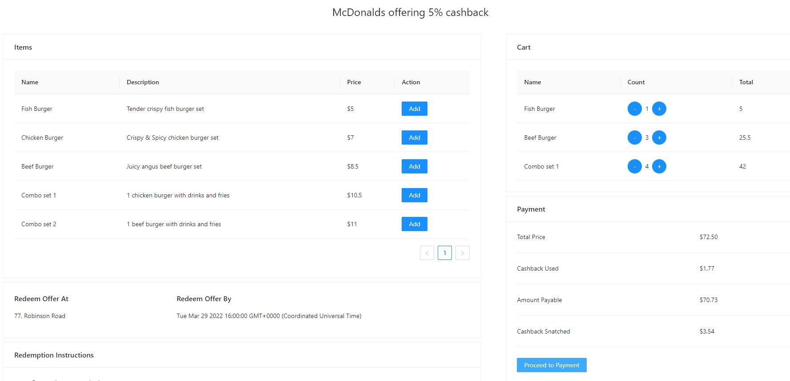
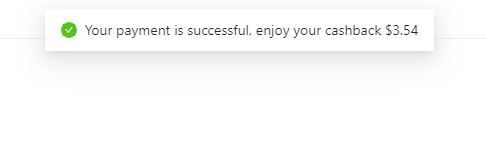

## Intro

This repo is to build next-generation cashback application, I named it 'iSnatch - Get ready to snatch cash back'.

This is an experimental project with React framework [Next.js](https://nextjs.org/) and Node.js framework [Nest.js](https://nestjs.com/).

## Live Demo

To learn about iSnatch app, take a look at the following resources:

- [iSnatch Web App](https://www.isnatch.xyz/) - see the live project in action.
- [iSnatch API](https://isnatch.herokuapp.com/api/) - see the API spec in swagger.

You can check out [Backend GitHub repository](https://github.com/zamanhasib/isnatch-server) 

You can check out [Frontend GitHub repository](https://github.com/zamanhasib/isnatch-web) 

- your feedback and contributions are welcome!

## Tech Stack Diagram (more coming)



## Database Collections





## Current Features

- Category listing 


- Items by Category listing


- Add sub items to Cart and Payment auto calculation


- Payment successful notification


## Upcoming Functional Features

- Location based listing (more granular listing and search)
- Vendor management (vendor can manage their products)
- Admin management (admin can add vendors and manage access)
- Customer profile management (customer can see their history and details)
- Vendor based cashback (customer can use cashback only to the venodor who gave cashback)
- Gift cashback (system to add gifts to regular customers profile)
- Cashback expiry (system to auto clear cashback if unused for long time)

## Upcoming Tech Features

- Use GraphQL for api between frontend and backend
- Add Redis caching
- Login system with JWT
- Elastic search functionality
- Use CDN for better performance
- Split payment to seperate microservice
- Implement Kafka message queue
- Use micro front ends to split large app

## Local Run

Run the frontend and backend app seperately:

```bash
npm run dev
# or
yarn dev
```

Open [http://localhost:3000](http://localhost:3000) with your browser to see the result.

You can start editing the page by modifying `pages/index.tsx`. The page auto-updates as you edit the file. This is the HOME page

Backend APIs can be accessed on [http://localhost:5000/](http://localhost:5000/). This is hosted seperately in Nest.js backend application.

## Deployment on Vercel and Heroku

The Front End application is deployed using [Vercel Platform](https://vercel.com/new?utm_medium=default-template&filter=next.js&utm_source=create-next-app&utm_campaign=create-next-app-readme) from the creators of Next.js.

The Back End application is deployed using [Heroku Platform](https://heroku.com/).

## Stay in touch

- Author - [Hasib Zaman](https://www.linkedin.com/in/zamanhasib/)
- Website - [About Me](https://hasibzaman.wordpress.com/)

## License

This app is [MIT licensed](https://opensource.org/licenses/MIT).
